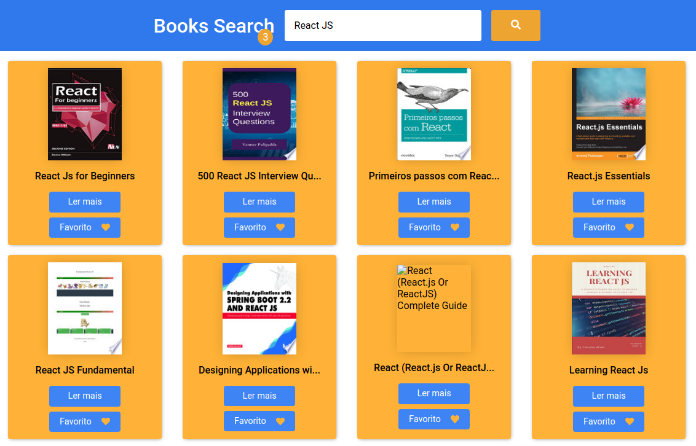

<div align="center" id="top"> 
  
</div>

<h1 align="center">Books Search</h1>

<br>

## About

Project development for Frontend Challenge.

## Screenshot

<div align="center" id="top"> 
  
</div>

## Technologies

The following tools were used in this project:

- [React](https://pt-br.reactjs.org/)
- [Sass](https://sass-lang.com/)
- [Axios](https://axios-http.com/)
- [React Modal](http://reactcommunity.org/react-modal/)
- [React Icons](https://www.typescriptlang.orghttps://react-icons.github.io/react-icons/)

## Requirements

Before starting 🏁: you need to have [Git](https://git-scm.com) and [Node](https://nodejs.org/en/) installed.

## 🏁 Starting

```bash
# Clone this project
$ git clone https://github.com/davi1985/books-search

# Access
$ cd books-search

# Creacte .env file
$ touch .env

## Add in .env file the API_KEY - this information was send in email.

# Install dependencies
$ yarn

# Run the project
$ yarn start

# The server will initialize in the <http://localhost:3000>
```

Made with 💜 by <a href="https://github.com/davi1985" target="_blank">Davi Silva</a>

&#xa0;

<a href="#top">Back to top</a>
